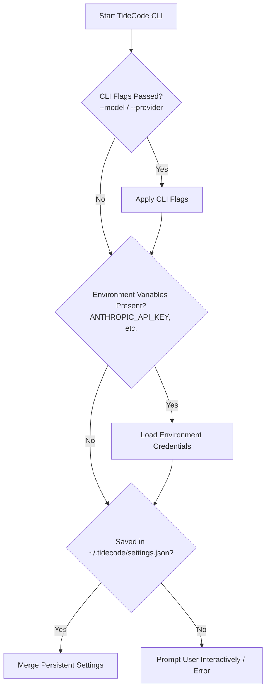

# Plan 004: Standalone NPM Package Distribution for TideCode CLI

Status: proposed

This plan establishes the design, build pipeline, and release workflow for distributing the TideCode CLI as a standalone npm package (`tidecode` / `npx tidecode`), enabling lightweight execution in headless environments (Linux servers, Docker containers, cloud devboxes, and CI/CD pipelines) without downloading the desktop Electron package.

This plan builds upon [Plan 003: Bundled CLI Distribution and Mobile Remote Control Relay](./plan-003.md).

---

## 1. Decision Summary

- **Standalone NPM Package (`tidecode`):** Publish a lightweight, Node.js-only distribution to the npm registry.
- **Instant Execution via NPX (`npx tidecode`):** Developers and CI runners can execute one-shot agent prompts without permanent installation.
- **Zero-GUI Footprint:** Strip out Electron, Chromium, React DOM, Monaco editor, and desktop assets, reducing the package size from ~90MB down to <5MB (excluding model dependencies).
- **Environment-First Authentication:** Automatically detect API keys from standard shell environment variables (`ANTHROPIC_API_KEY`, `OPENAI_API_KEY`, `GEMINI_API_KEY`, `DEEPSEEK_API_KEY`, `MISTRAL_API_KEY`) alongside the stored credentials in `~/.tidecode/settings.json`.
- **Shared Monorepo Pipeline:** Build the npm package directly from the TideCode repository alongside the desktop releases via GitHub Actions with npm provenance.

---

## 2. Target Use Cases & Environments

```text
┌─────────────────────────────────────────────────────────────────────────────────┐
│                              TideCode NPM Targets                               │
├───────────────────────────────┬─────────────────────────────────────────────────┤
│ Cloud Devboxes & Remote VMs   │ GitHub Codespaces, Gitpod, AWS EC2, Hetzner,    │
│                               │ headless Ubuntu/Debian/Arch servers.            │
├───────────────────────────────┼─────────────────────────────────────────────────┤
│ CI/CD & Automated Pipelines   │ GitHub Actions, GitLab CI, Bitbucket Pipelines  │
│                               │ (automated PR review, lint/test fixing).        │
├───────────────────────────────┼─────────────────────────────────────────────────┤
│ Ephemeral Execution           │ `npx tidecode -p "explain repo structure"`      │
├───────────────────────────────┼─────────────────────────────────────────────────┤
│ Headless Remote Daemons       │ Running `tidecode remote` inside a VPS or tmux  │
│                               │ session to steer from mobile anywhere.          │
└───────────────────────────────┴─────────────────────────────────────────────────┘
```

---

## 3. Package Structure & Build Architecture

### 3.1 Directory Layout for NPM Distribution
```text
packages/cli/ (or dist-cli/)
├── bin/
│   └── tidecode.js                <-- Executable entry point with #!/usr/bin/env node
├── dist/
│   └── index.js                   <-- Bundled Node.js agent engine
├── package.json                   <-- Standalone publish manifest
└── README.md                      <-- CLI-focused documentation
```

### 3.2 Published `package.json` Specification
```json
{
  "name": "tidecode",
  "version": "1.2.0",
  "description": "Autonomous AI coding agent in your terminal",
  "bin": {
    "tidecode": "./bin/tidecode.js"
  },
  "type": "module",
  "engines": {
    "node": ">=20.0.0"
  },
  "repository": {
    "type": "git",
    "url": "https://github.com/ceciliomichael/TideCode.git"
  },
  "keywords": [
    "ai",
    "agent",
    "coding-agent",
    "cli",
    "anthropic",
    "openai",
    "codex",
    "mcp"
  ],
  "license": "MIT"
}
```

---

## 4. Handling Native Binary Dependencies

| Dependency | Desktop App Approach | Standalone NPM CLI Approach |
| :--- | :--- | :--- |
| **`@vscode/ripgrep`** | Synced via `scripts/sync-ripgrep-binary.mjs` into `resources/ripgrep`. | Installed via standard npm optional platform dependencies or resolved from system `PATH` if `rg` is already installed. |
| **`node-pty`** | Prebuilt native module for Electron. | Standard Node native compilation on install (`node-gyp`), with graceful fallback to Node's `child_process.spawn` for basic terminal tasks if native build fails in minimal container images. |

---

## 5. Configuration & Authentication Hierarchy

When running through the CLI on a headless server, TideCode resolves settings and credentials using the following strict precedence:



---

## 6. Developer & CI/CD Workflows

### 6.1 Interactive Shell Usage
```bash
# Global installation
npm install -g tidecode

# Launch interactive agent in current directory
tidecode

# Launch with specific model override
tidecode --model claude-3-7-sonnet
```

### 6.2 Ephemeral One-Shot Runner (`npx`)
```bash
# Zero-install bug fixing
npx tidecode -p "Investigate why tests in test/auth.test.ts are failing and fix them"
```

### 6.3 Headless Server Remote Daemon
```bash
# Start background remote relay inside tmux on a cloud VPS
tidecode remote --pair
# Generates mobile pairing link/QR code for remote steering
```

### 6.4 GitHub Actions Integration
```yaml
name: TideCode Auto-Review & Fix
on: [pull_request]

jobs:
  agent-check:
    runs-on: ubuntu-latest
    steps:
      - uses: actions/checkout@v4
      - uses: actions/setup-node@v4
        with:
          node-version: 20
      - name: Run TideCode Auto-Fixer
        env:
          ANTHROPIC_API_KEY: ${{ secrets.ANTHROPIC_API_KEY }}
        run: |
          npx tidecode -p "Run npm test and fix any compilation or unit test errors"
```

---

## 7. Release & CI/CD Pipeline

A dedicated GitHub Actions workflow (`.github/workflows/publish-cli-npm.yml`) automates npm publishing whenever a new release tag is pushed:

```yaml
name: Publish CLI to NPM

on:
  release:
    types: [published]
  workflow_dispatch:

jobs:
  publish:
    runs-on: ubuntu-latest
    permissions:
      contents: read
      id-token: write
    steps:
      - uses: actions/checkout@v4
      - uses: actions/setup-node@v4
        with:
          node-version: 20
          registry-url: 'https://registry.npmjs.org'
      - run: npm ci
      - name: Build CLI Bundle
        run: npm run build:cli
      - name: Publish with Provenance
        run: npm publish --provenance --access public
        env:
          NODE_AUTH_TOKEN: ${{ secrets.NPM_TOKEN }}
```

---

## 8. Implementation Roadmap

| Phase | Milestone | Focus Areas |
| :--- | :--- | :--- |
| **Phase 1** | **Build Script & Entry Point** | Create `scripts/build-cli.mjs` bundling `electron/chat/shared` into a Node-compliant `dist-cli/index.js` with `#!/usr/bin/env node`. |
| **Phase 2** | **Env Var Credential Loader** | Implement zero-config fallback to `process.env.ANTHROPIC_API_KEY`, `process.env.OPENAI_API_KEY`, etc. |
| **Phase 3** | **Native Fallbacks** | Ensure clean fallback to `child_process` when running in stripped Docker Alpine images where `node-pty` cannot build. |
| **Phase 4** | **NPM Automation** | Configure GitHub Actions automated publishing to `https://www.npmjs.com/package/tidecode`. |
